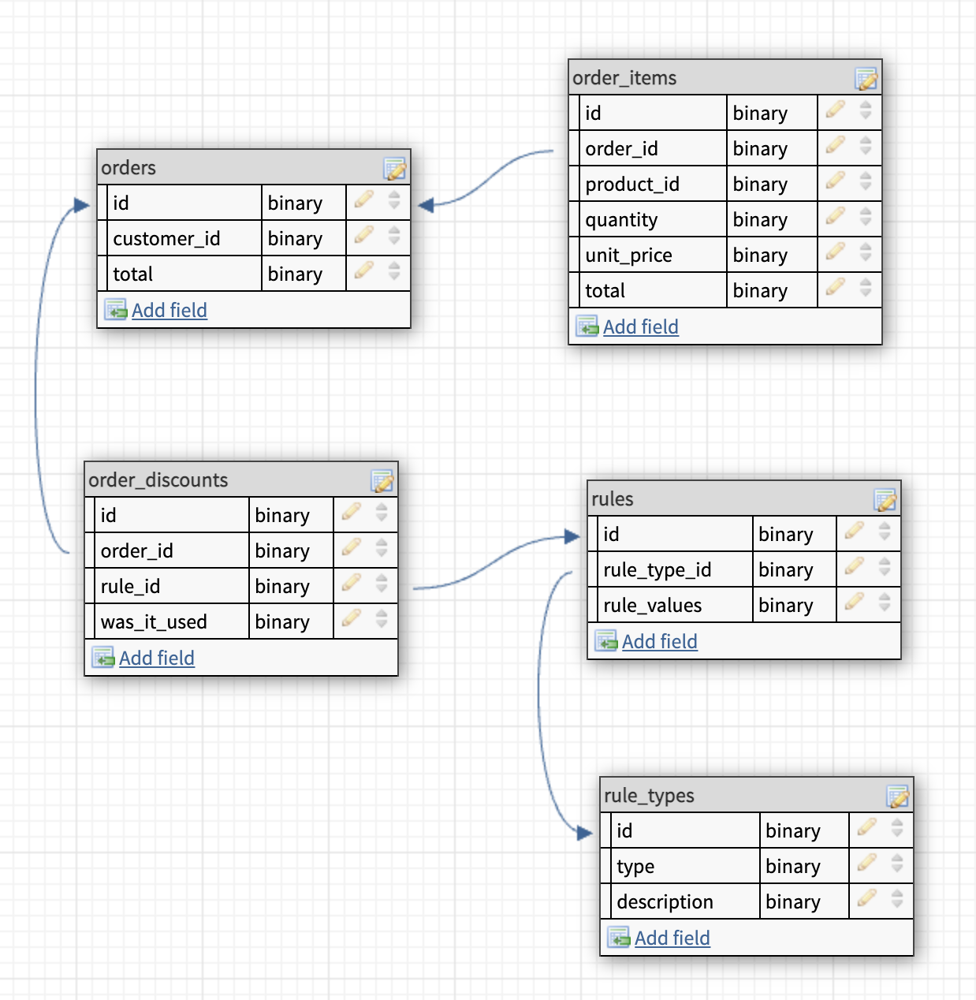

***Ordering application with discount rules***

The discount rules in the application were implemented using the factory method.

The path to the pattern I wrote for the rule is "App\Properties\Discount*."

The configuration file determined for the rule is located at "config\rule-types."

---

Commands to be run;
        
        php artisan serve
        php artisan fresh

---

**DB Designer - Discount Design**

**Order Store - Request**

**Calculate Discount - Request**

